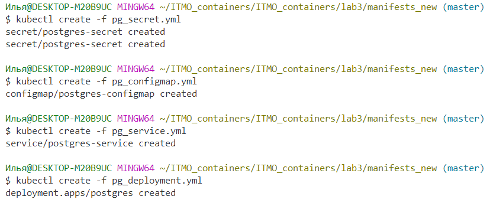

## Задание:
    
Осуществить махинации над манифестами из примера, чтоб получить следующее:
    
- Для постгреса перенести `POSTGRES_USER` и `POSTGRES_PASSWORD` из конфигмапы в секреты (очевидно, понадобится новый манифест для сущности Secret)
- Для некстклауда перенести его переменные (`NEXTCLOUD_UPDATE`, `ALLOW_EMPTY_PASSWORD` и проч.) из деплоймента в конфигмапу (очевидно, понадобится новый манифест для сущности ConfigMap)
- Для некстклауда добавить `Liveness` и `Readiness` пробы

## Новые манифесты в папке `manifests_new`

##### Вопрос: важен ли порядок выполнения этих манифестов? Почему?

Да, поскольку configmap должен быть создан первым, поскольку service и deployment используют заданные в нем настройки (переменные среды). Насколько я понимаю, service имеет смысл создать после configmap, но до deployment, чтобы поды сразу правильно распределились (Так написано в документации: it's best to specify the Service first, since that will ensure the scheduler can spread the pods associated with the Service as they are created by the controller(s), such as Deployment.)

##### Вопрос: что (и почему) произойдет, если отскейлить количество реплик postgres-deployment в 0, затем обратно в 1, после чего попробовать снова зайти на Nextcloud? 

Снова зайти на nextcloud не получается (поскольку сама база данных перестает быть доступна при понижении количества реплик до 0, а при возвращении до 1 nextcloud сам заново к ней не подключается).

### Ход работы:

### Часть 1. Установка minikube (опционально)

После установки и запуска minikube:

### Часть 2. Создаем объекты через CLI

Шаг 1. В терминале [в текущей папке] создать yml-файлы (манифесты) конфигмапы, сервиса и деплоймента.
Шаг 2. Прогнать манифесты, чтоб описанные объекты создались в кластере, с помощью команды `kubectl create –f имя_файла`

Шаг 3. Проверить, что все ресурсы успешно создались, с помощью команды `kubectl get тип_ресурса`. Чтобы посмотреть конкретный ресурс, нужно обратиться к нему через `kubectl describe тип_ресурса/имя_ресурса` (вместо слеша можно пробел, такой синтаксис тоже поддерживается).

Шаг 4. Создать nextcloud.yml и повторить для него шаги 1-3.

Можно обратить внимание, что при попытке посмотреть секрет, содержимое не показывается:

Шаг 5. После успешного запуска пода можно проверить его состояние с помощью команды kubectl logs имя_пода. Nextcloud начнет установку (самоинициализацию) автоматически, какое-то время следует подождать до ее скорее всего успешного завершения

### Часть 3. Подключение извне (опционально)

Шаг 1. Кроме уже упомянутого способа выше (через манифест), объект типа Service для конкретного деплоймента можно создать специальной командой kubectl expose deployment имя_деплоймента параметры_перенаправления, которая автоматически обеспечит нужное перенаправление портов.

Шаг 2. Осуществить туннелирование трафика между нодой minikube и Сервисом с помощью команды minikube service имя_сервиса. Команда “захватит” терминал на все время выполнения (в данном случае до ручного прерывания по Ctrl-C)

