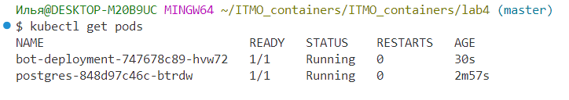
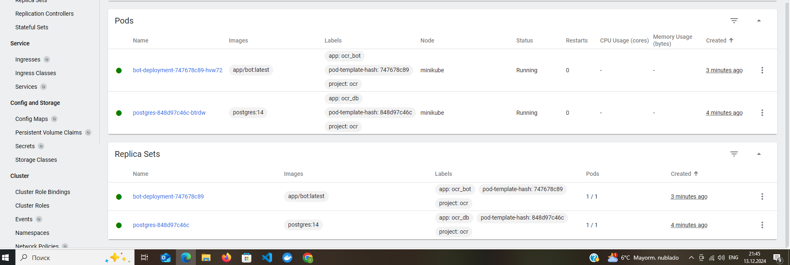

Здесь равзворачивается такой же бот, как в лабораторной 4.

### Ход работы:

1. Запускаем minikube, подключаемся к дашборду.

2. Строим образ для бота по `Dockerfile`.

3. Грузим его в minikube.

4. Строим объекты для базы данных.

5. Разворачиваем деплоймент бота (также в нем init-контейнер, выводящий сообщение об иницилизации из образа busybox).

6. Получили 2 работающих пода

7. Можем посмотреть дашборд

